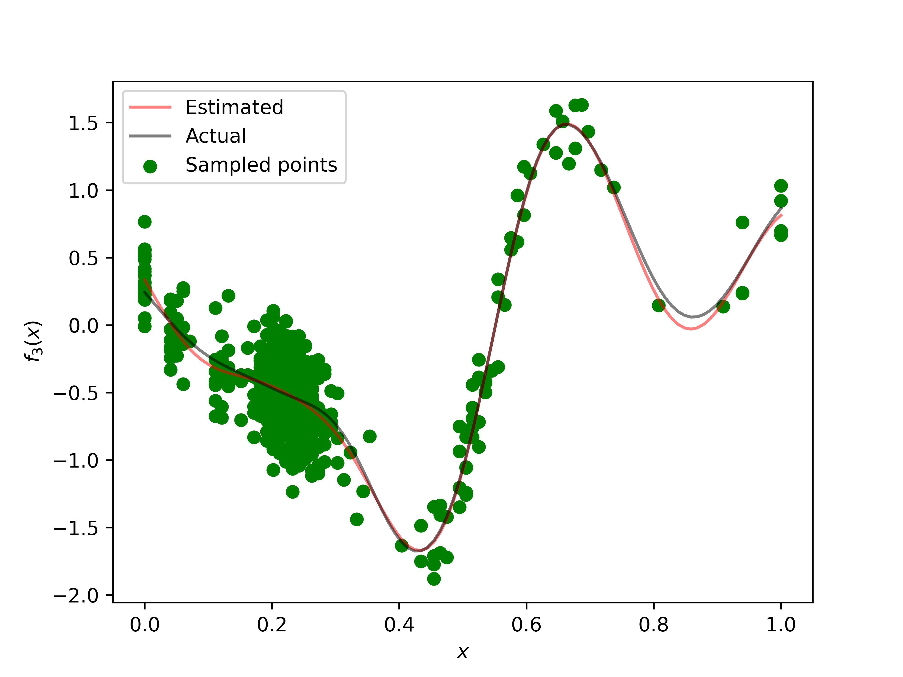

# Codes: Distributed Optimization via Kernelized Multi-armed Bandits

*Here we present the codes of  fully decentralized algorithm, Multi-agent IGP-UCB (MA-IGP-UCB) and  Multi-agent Delayed IGP-UCB (MAD-IGP-UCB) algorithm. These algorithms achieve sub-linear regret bound, and does not require the agents to share their actions, rewards, or estimates of their local function. The agents sample their individual local functions in a way that benefits the whole network by utilizing a running consensus to estimate the upper confidence bound on the global function.*

## Requirements
* gpytorch=1.10
* networkx=3.1
* numpy=1.24.3
* pytorch=2.0.0
* scipy=1.10.1
* matplotlib=3.7.1
* tqdm=4.65.0 

## How to run the code-
`python batch_run.py --con --epo --run --ker --net`

where --con | --epo | --run | --ker| --net are required parameters.

* --con : Consensus algorithm-
    *  private (MA-IGP-UCB)
    * central (MA-IGP-UCB: completely connected setting)
    * delayed (MAD-IGP-UCB)
* --epo : Total number of iterations (T) 
* --run : Run number (0-99) 
* --ker : Kernel to be used 
    * rbf (Squared exponential kernel)
    * mat (Matern kernel)
* --net : Network to be used
    * random (Erdos-Reny)
    * facebook (SNAP network)
    * twitch (SNAP network)
    * skitter (SNAP network)
    * small (5 agent)

## Output
- The variable `safe_fig` is set to `'yes'` to save the data.
- The code outputs the following-
    1. Plots of local function learnt by each agent along with sampling points
    2. Plots of global function learnt by each agent along with sampling points
    3. Plot of network reward (pdf)
    4. Plot of cumulative regret (pdf)
    5. A .mat file with all the data

## Example 1 (from Supplementary material)
`python batch_run.py --con private --epo 1000 --run 2 --ker rbf --net small`

Plots of local function learnt by each agent along with sampling points:

Plots of global function learnt by each agent along with sampling points:

## Example 2 (from Supplementary material)
`python batch_run.py --con delayed --epo 1000 --run 2 --ker rbf --net small`

Plots of local function learnt by each agent along with sampling points:

Plots of global function learnt by each agent along with sampling points:

# Note
- Parameters like `l`, `e_sigma` ($\sqrt \lambda$), `C`, `cuda_a` (if cude is available) can be changed inside 'batch_run.py'
- Seed is set as $500+$`run`, and the experiments in the supplementary material are obtained at `run=2`.
- For SNAP networks, 100 graphs with 100 agents are subsampled from each network and corresponsding adjacency matrices are saved in 'poplular_adj_100agents_100runs.mat'.